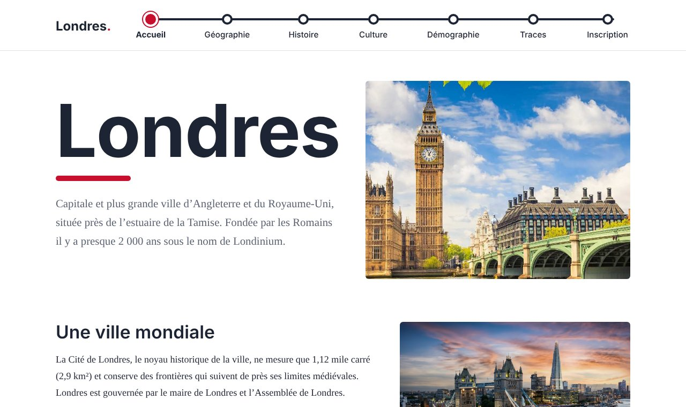

# Londres – site de découverte

Site web statique consacré à Londres : géographie, histoire, culture, démographie et lieux célèbres. Il est réalisé en HTML, CSS et JavaScript, sans bibliothèque externe.

**🔗 Voir le site en ligne : https://hadi56a.github.io/london-travel-guide/**



## Pages

| Page | Contenu | Fonctionnalité JavaScript |
| --- | --- | --- |
| Accueil | Présentation de la ville | Convertisseur euros → livres sterling, diaporama |
| Géographie | Définition, parcs, climat | Tableau des températures coloré, diaporama |
| Histoire | De Londinium au Blitz | Diaporama automatique |
| Culture | Arts, musées, musique | Calcul de l'âge d'un musée, diaporama, vidéo |
| Démographie | Population et évolution | Quiz, diaporama de cartes et graphiques |
| Traces | Big Ben, Westminster, lieux de tournage d'Harry Potter | Quiz, mini-jeu du bus (clavier ou tactile), calcul du prix des billets |
| Inscription | Formulaire de création de compte | Vérification des champs avec messages d'erreur |

## Points techniques

- Une seule feuille de style (`css/style.css`), responsive du téléphone à l'ordinateur.
- Un composant de diaporama réutilisable (`script/main.js`), configuré par des attributs HTML (`data-autoplay`, `data-thumbs`).
- Aucune fenêtre `alert()` : tous les résultats et toutes les erreurs s'affichent dans la page.
- Accessibilité : textes alternatifs sur les images, navigation au clavier, focus visible, préférence « moins d'animations » respectée.

## Lancer le site

Ouvrir `index.html` dans un navigateur. Aucune installation n'est nécessaire.

Pour le publier avec GitHub Pages : *Settings → Pages → Branch : main / root*.

## Structure

```
├── index.html
├── page/            autres pages du site
├── css/style.css
├── script/          main.js (diaporama) + un script par page
├── Images/
├── Data/            vidéo
└── docs/            capture d'écran du README
```

## Sources

Ce projet a été réalisé dans un cadre scolaire. Les textes sont adaptés de :

- [Wikipédia – Londres](https://fr.wikipedia.org/wiki/Londres) et articles liés (histoire, géographie, démographie, climat), sous licence CC BY-SA
- [Culturez-vous – Les plus beaux musées de Londres](https://culturezvous.com/les-plus-beaux-musees-de-londres/)
- [Londres.fr](https://www.londres.fr/) pour Big Ben et le palais de Westminster

Les images proviennent de recherches sur le web et restent la propriété de leurs auteurs.

## Auteur

Hadi Assi
